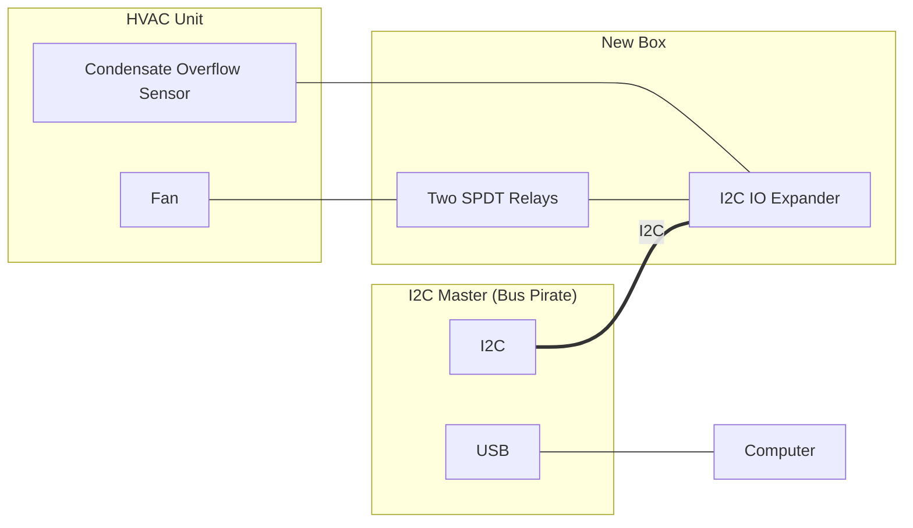

# Description

## Existing HVAC unit

Each existing HVAC unit consists of:

- fan
    - fractional horsepower permanent split capacitor fan motor
    - three wires: common, low-speed, high-speed
- hot/cold pipe
- condensate tray

The fan is manually controlled by the occupant using a
single-pole, triple-throw switch mounted on the outside of the
HVAC unit.

The condensate tray catches pipe condensate during the cooling
season. The water often builds up faster than it evaporates;
water spills out resulting in property damage.

## HVAC unit upgrade

This diagram shows the relationship between the existing HVAC
unit, the new box, and the Bus Pirate to the test computer.

The Bus Pirate and computer are a proxy for the new user
interface by RL. *The new user interface is not in the scope of
work.*

*The diagram only shows electronics, it does not show any of the
electrical work.*

RL upgrade of HVAC unit adds the following functionality:

- **control** fan over I2C
    - replace manual switch with relays
    - control relays with GPIO expander
- **monitor** condensate tray over I2C
    - add water sensor to condensate tray
    - monitor output of water sensor with GPIO expander

RL to design and install new user interface on front of unit:

Cables from new user interface pass through hole in front of unit
and connect to box. Cables include:

- 12VDC power extender cable
- I2C cable

TODO: provide part numbers and details on these cables

Condensate tray sensor:

Use an I2C-GPIO expander to provide I2C controls and monitoring.

Use a Bus Pirate as a proxy for the I2C master. *The I2C master
is outside the scope of this work. Demonstrating control with the
Bus Pirate is included in the scope of work.*

TODO: I2C-GPIO expander details
